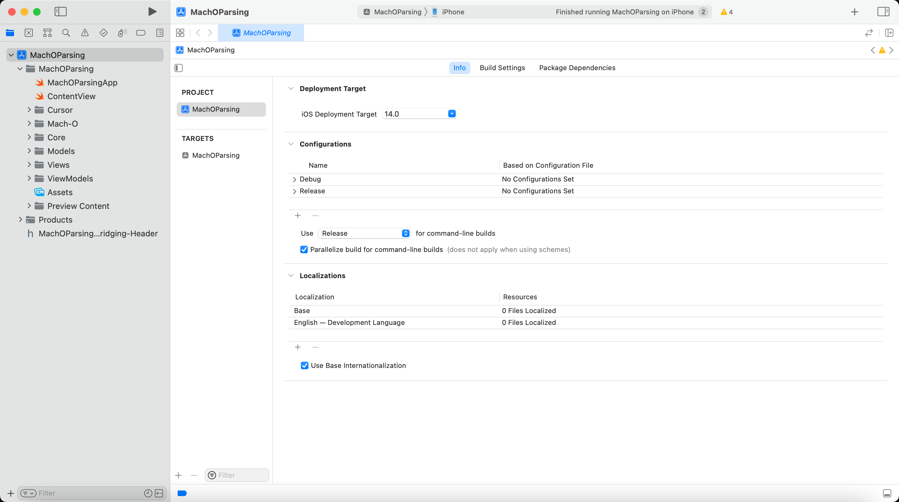
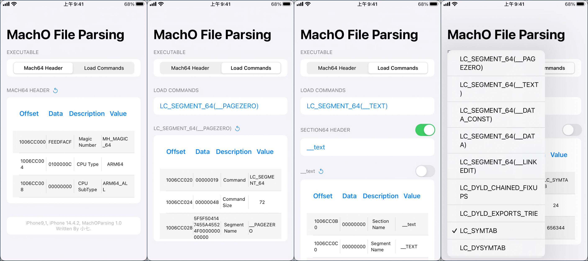

# MachOFileParser
## 一、软件&硬件环境

- **Xcode：Version 13.3 (13E113)；**
- **iPhone：iPhone 7(越狱)，iOS 14.4.2；**
- **编程语言：Swift + OC + C；**

****

## 二、MachOParsing 简介

> **项目是基于 SwiftUI 绘制的界面，最低支持的系统版本是 iOS 14，主要是因为 OC 画界面短时间学不会，所以低版本的 iOS 系统就不支持了。功能实现是用 `OC + C`。**

****

## 三、功能介绍（更新中）

> **【注】使用过程中，可能会有闪退，重新点开即可，查找原因ing。**

| 功能               | 介绍                                              | 已开发                                                       | 备注                         |
| ------------------ | ------------------------------------------------- | ------------------------------------------------------------ | ---------------------------- |
| 主程序文件解析     | 模仿 MachOView 界面展示，将解析出的字段进行显示。 | Mach64 Header Load Commands Section64 Header Symbol Table String Table Dysymbol Table | 其他解析功能还在完善过程中。 |
| 其他动态库文件解析 | 将主程序运行时，所加载的其他动态库文件进行解析。  | 待开发。                                                     |                              |

## 四、功能展示

****

## 五、参考链接

- **https://github.com/gdbinit/MachOView**
- **https://github.com/nygard/class-dump**

****

